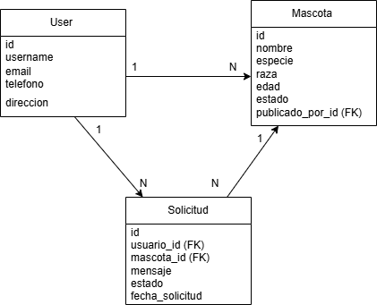
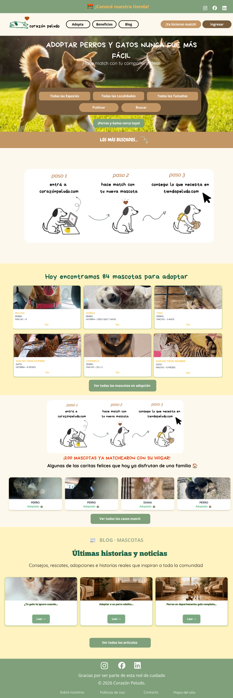

# Programacion-I-
Sistema de Adopción de mascotas 

Este proyecto consiste en el desarrollo de una API para la gestión de adopción de mascotas. 
Los usuarios pueden publicar mascotas en adopción y otros usuarios pueden solicitar adoptarlas. 

Entidades Principales:  
- User | Usuario del sistema. Hereda de `AbstractUser` y almacena información básica del usuario. 
- Mascota | Representa las mascotas publicadas para adopción. 
- Solicitud | Representa las solicitudes realizadas para adoptar una mascota. 

Relaciones: 
- Un usuario puede publicar múltiples mascotas (1:N)
- Un usuario puede realizar múltiples solicitudes de adopción (1:N)
- Una mascota puede tener múltiples solicitudes (1:N)

Funcionalidades: 
- Crear usuarios
- Publicar mascotas 
- Solicitar adopción
- Listar solicitudes

Objetivo: 
El objetivo de este proyecto es desarrollar un backend utilizando Django que permita gestionar el proceso de adopción de mascotas. 
Se busca implementar una API que facilite:
- la creación de usuarios, 
- la publicación de mascotas en adopción,
- la gestión de solicitudes por parte de otros usuarios. 

Modelo de Datos:
Diagrama entidad-relación: 


Tecnologías utilizadas: 
- Python
- Django 
- Django Rest Framework
- PostgreSQL
- Swagger

Requisitos Previos: 
Para ejecutar este proyecto necesitás tener instalado: 
- Python 
- Git 
- PostgreSQL 

Instalación: 
1. Clonar el repositorio: 
git clone <URL_DEL_REPOSITORIO>
cd <NOMBRE_DEL_REPOSITORIO>
2. Crear entorno virtual: 
python -m venv venv 
3. Activar entorno virtual: 
venv\Scripts\Activate.ps1
4. Instalar dependencias: 
pip install -r requirements.txt
5. Aplicar migraciones: 
python manage.py migrate 
6. Ejecutar el servidor: 
python manage.py runserver 

Ejecutar el proyecto: 
Para iniciar el servidor de desarrollo ejecutar: 
python manage.py runserver
Acceso: 
- http://127.0.0.1:8000/
- http://127.0.0.1:8000/admin/

## Frontend - React

A partir del Trabajo Práctico N°5 se incorpora el frontend de la aplicación utilizando React con Vite.

El frontend se encuentra en el directorio `frontend/` dentro del mismo repositorio que el backend y se ejecuta en el puerto 3000.

Para iniciar el servidor de desarrollo:

```bash
cd frontend
npm install
npm run dev
```

Acceso:

- http://localhost:3000/

## Diseño inicial

Se realizó un bosquejo de la pantalla principal (Home) de la aplicación de adopción de mascotas como referencia para el desarrollo del frontend.

El diseño contempla la navegación principal, búsqueda y filtrado de mascotas, mascotas disponibles para adopción, información sobre el proceso de adopción y otras secciones informativas.


Accesos: 
API: http://127.0.0.1:8000/api/
Panel de administración: http://127.0.0.1:8000/admin/
Documentación Swagger: http://127.0.0.1:8000/api/docs/ 
